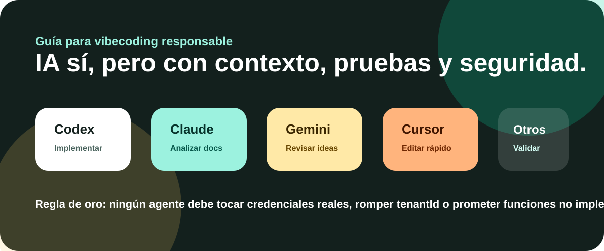

# Guía de agentes IA para Capi Pedidos SaaS



Esta guía ayuda a conectar el proyecto con agentes como Claude, Codex, Gemini, Cursor, Windsurf, Antigravity, GitHub Copilot u otros asistentes de programación.

El objetivo no es que la IA escriba código a ciegas. El objetivo es que trabaje con contexto, respete la arquitectura y valide antes de terminar.

---

## 1. Archivos de contexto para agentes

| Archivo | Agente/uso |
|---|---|
| `AGENTS.md` | Reglas generales para cualquier agente. |
| `CLAUDE.md` | Contexto corto para Claude. |
| `CODEX.md` | Contexto corto para Codex. |
| `GEMINI.md` | Contexto corto para Gemini. |
| `.github/copilot-instructions.md` | Instrucciones para GitHub Copilot. |
| `docs/DOCUMENTACION_TECNICA.md` | Arquitectura completa. |
| `docs/MANUAL_DE_USO.md` | Flujo de uso del sistema. |
| `docs/GUIA_VIBECODING.md` | Cómo pedir cambios paso a paso. |

---

## 2. Prompt base universal

Copia este prompt en cualquier agente antes de pedir cambios:

```text
Trabaja sobre Capi Pedidos SaaS.

Antes de modificar código, lee:
- README.md
- AGENTS.md
- docs/DOCUMENTACION_TECNICA.md
- docs/MANUAL_DE_USO.md

Reglas obligatorias:
- Mantén la UI en español México.
- No agregues datos reales, tokens, passwords ni conexiones privadas.
- No subas .env.
- Respeta el aislamiento multi-tenant con tenantId.
- No prometas funciones que no existan en Lite, Pro o Enterprise.
- Si cambias comportamiento, actualiza README o docs.
- Ejecuta npm run lint y npm run build antes de cerrar.

Tarea:
[describe aquí la tarea]
```

---

## 3. Claude

Claude suele ser útil para:

- Analizar documentación extensa.
- Revisar arquitectura.
- Proponer flujos de negocio.
- Encontrar huecos entre lo que se promete y lo que existe.
- Redactar documentación clara.

Prompt sugerido:

```text
Actúa como arquitecto de producto SaaS para restaurantes.
Lee README.md, docs/DOCUMENTACION_TECNICA.md y docs/MANUAL_DE_USO.md.

Quiero que revises si la funcionalidad actual coincide con los planes Lite, Pro y Enterprise.
Devuélveme:
1. Riesgos de prometer de más.
2. Mejoras de UX.
3. Cambios técnicos necesarios.
4. Archivos que probablemente deben tocarse.
No edites código todavía.
```

---

## 4. Codex

Codex suele ser útil para:

- Implementar cambios en código.
- Refactorizar componentes.
- Ejecutar pruebas y builds.
- Hacer commits organizados.
- Revisar errores de TypeScript/Next.js.

Prompt sugerido:

```text
Implementa esta mejora en Capi Pedidos SaaS:
[describe mejora]

Antes de editar:
- Revisa AGENTS.md.
- Identifica archivos relacionados.
- No toques credenciales.
- Mantén UI en español México.

Al terminar:
- Ejecuta npm run lint.
- Ejecuta npm run build.
- Actualiza documentación si aplica.
- Resume archivos modificados.
```

---

## 5. Gemini

Gemini suele ser útil para:

- Comparar alternativas.
- Revisar ideas de producto.
- Ayudar con estructura de documentación.
- Evaluar consistencia visual y comercial.

Prompt sugerido:

```text
Revisa este proyecto como consultor de SaaS para restaurantes en México.
Lee README.md y docs/ANALISIS_REFERENCIAS_MENUS_INTERACTIVOS.md.

Dame recomendaciones para mejorar:
- Landing.
- Menú público.
- Panel administrador.
- Flujo de cocina.
- Caja.
- Planes comerciales.

No propongas funciones genéricas: aterriza cada mejora a archivos o módulos del proyecto.
```

---

## 6. Cursor / Windsurf / Antigravity

Estos editores/agentes suelen trabajar bien cuando se les da una tarea pequeña y verificable.

Ejemplo de tarea buena:

```text
En src/components/public/menu-client.tsx mejora la accesibilidad del carrito móvil.
No cambies la lógica de precios.
Mantén textos en español México.
Después ejecuta npm run lint.
```

Ejemplo de tarea riesgosa:

```text
Mejora todo el sistema y hazlo más bonito.
```

La segunda es demasiado abierta. Puede provocar cambios grandes, errores o regresiones.

---

## 7. Checklist antes de aceptar cambios de IA

| Pregunta | Debe ser sí |
|---|---|
| ¿Pasó `npm run lint`? | Sí |
| ¿Pasó `npm run build`? | Sí |
| ¿No se tocó `.env`? | Sí |
| ¿No se agregaron secretos? | Sí |
| ¿Respeta `tenantId`? | Sí |
| ¿La UI sigue en español México? | Sí |
| ¿Se actualizó documentación si cambió flujo? | Sí |
| ¿Los planes no prometen de más? | Sí |

---

## 8. Tareas ideales para agentes

- Mejorar copy y UX de landing.
- Crear componentes visuales reutilizables.
- Agregar validaciones Zod.
- Mejorar estados vacíos.
- Crear pruebas.
- Refactorizar consultas repetidas.
- Documentar módulos.
- Revisar accesibilidad.
- Revisar seguridad.

---

## 9. Tareas que requieren cuidado humano

- Cambiar modelo de datos.
- Cambiar auth y roles.
- Cambiar cálculos de precio.
- Cambiar lógica de cobro/caja.
- Cambiar aislamiento multi-tenant.
- Integrar pagos reales.
- Manejar datos reales de clientes.

---

## 10. Regla de oro

Un agente puede acelerar el trabajo, pero no debe decidir por sí solo reglas de negocio, precios, seguridad o promesas comerciales.
