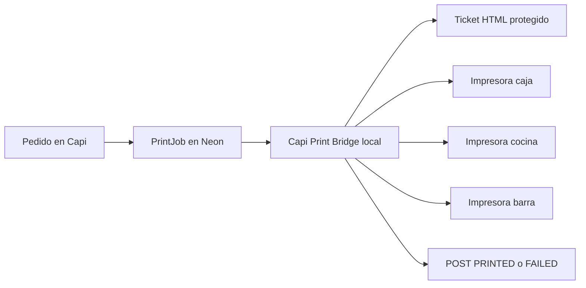

# Documentación técnica - Capi Pedidos SaaS


Fecha de actualización: abril 2026  
Estado: base colaborativa pública, preparada para despliegues propios.  
Versión documental: v0.097.

---

## 1. Objetivo

Capi Pedidos SaaS es una plataforma multi-tenant para restaurantes y negocios de comida. Permite publicar menús digitales, recibir pedidos por WhatsApp y administrar operación diaria desde un panel web.

La aplicación está pensada para México y Latinoamérica:

- Textos en español México.
- Precios en pesos mexicanos.
- Demos con ejemplos de comida mexicana.
- Flujo operativo compatible con restaurantes pequeños y medianos.
- Módulos opcionales para negocios que ya tienen punto de venta.

---

## 2. Explicación simple para personas no técnicas

Piensa en Capi como tres piezas conectadas:

| Pieza | Explicación simple |
|---|---|
| 📱 Menú público | Lo que ve el cliente para elegir productos. |
| 🧑‍💼 Panel admin | Lo que usa el restaurante para administrar menú, pedidos, cocina y caja. |
| 🗄️ Base de datos | Donde se guarda todo: negocios, usuarios, productos, pedidos y cortes. |

Cada restaurante tiene su propio espacio de datos. Eso se llama `multi-tenant`.

---

## 3. Arquitectura

| Capa | Tecnología | Responsabilidad |
|---|---|---|
| Web app | Next.js 16 App Router | Landing, menú público, admin y API routes |
| UI | React 19 + Tailwind CSS 4 | Interfaz responsive |
| Autenticación | NextAuth Credentials + JWT | Login y sesión admin |
| ORM | Prisma | Modelo de datos y consultas |
| Base de datos | PostgreSQL | Persistencia multi-tenant |
| Hosting sugerido | Vercel | Build, deploy, dominio, SSL y Cron |
| Datos demo | @faker-js/faker | Ventas, pedidos y cortes realistas |

---

## 4. Flujo de pedido


1. El cliente entra a `/<slug>`.
2. Revisa categorías, productos, ingredientes, imágenes y modificadores según plan.
3. Agrega productos al carrito.
4. Captura datos de contacto y tipo de servicio.
5. El frontend envía `POST /api/orders`.
6. El backend recalcula precios, valida productos y guarda `Order` + `OrderItem`.
7. El pedido aparece en `/admin/orders` y, si aplica, en `/admin/kitchen`.
8. El sistema devuelve URL de WhatsApp con mensaje listo.
9. Caja puede marcar pago y cerrar corte.

---

## 5. Multi-tenant

Cada negocio vive como un `Tenant`.

| Concepto | Uso |
|---|---|
| `Tenant` | Restaurante o negocio cliente. |
| `tenantId` | Llave que separa datos por negocio. |
| `slug` | Nombre usado en URL pública, por ejemplo `/fonda_lupita`. |
| `version` | Plan contratado: Lite, Pro o Enterprise. |

Regla crítica:

> Toda consulta operativa debe respetar `tenantId`. Si se omite, existe riesgo de mezclar datos entre negocios.

---

## 6. Roles

| Rol | Uso |
|---|---|
| `SUPER_ADMIN` | Administra tenants, planes, vigencias y demos. |
| `ADMIN` | Opera un negocio específico. |
| `CAJERO` | Rol preparado para cobros, apertura/cierre y movimientos de caja. |
| `MESERO` | Rol preparado para comandero, mesas, precuentas y pedidos de salón. |
| `COCINA` | Rol preparado para monitor de producción. |
| `STAFF` | Reservado para futuras funciones de personal. |

---

## 7. Modelo de datos principal

| Modelo | Uso |
|---|---|
| `Tenant` | Negocio/cliente SaaS |
| `User` | Usuarios administrativos |
| `Category` | Categorías del menú |
| `Product` | Productos vendibles |
| `Ingredient` | Ingredientes visibles en menú público |
| `ModifierGroup` | Grupos de modificadores |
| `Modifier` | Opciones de modificador con precio |
| `Order` | Pedido |
| `OrderItem` | Producto dentro del pedido |
| `CashCut` | Corte de caja |
| `CashDrawer` | Caja/cajón configurable por negocio |
| `CashSession` | Turno de caja abierto o cerrado |
| `CashMovement` | Entrada, salida, gasto, retiro, adelanto o ajuste |
| `OrderPayment` | Pago registrado por pedido; permite base para pago mixto |
| `DiningTable` | Mesa física del restaurante |
| `PrinterStation` | Estación/impresora lógica para cocina, barra, caja o general |
| `PrintJob` | Trabajo de impresión tomado por el puente local |
| `Settings` | Configuración del negocio y tema público |

---

## 8. Enums relevantes

| Enum | Valores principales |
|---|---|
| `Version` | `LITE`, `PRO`, `ENTERPRISE` |
| `PublicTemplate` | `CLASICO`, `MERCADO`, `ELEGANTE`, `TAQUERIA`, `MARISQUERIA`, `CAFETERIA`, `PIZZERIA`, `SUSHI`, `HAMBURGUESAS`, `ANTOJITOS`, `BAR_BOTANERO`, `DARK_KITCHEN`, `POLLERIA` |
| `OrderStatus` | `PENDING`, `CONFIRMED`, `PREPARING`, `READY`, `COMPLETED`, `CANCELLED` |
| `ServiceType` | `MOSTRADOR`, `MESA`, `RECOGER`, `DOMICILIO` |
| `PaymentStatus` | `PENDIENTE`, `PAGADO`, `CANCELADO` |
| `PaymentMethod` | `EFECTIVO`, `TARJETA`, `TRANSFERENCIA`, `OTRO` |
| `CashSessionStatus` | `ABIERTA`, `CERRADA` |
| `CashMovementType` | `ENTRADA`, `SALIDA`, `RETIRO`, `GASTO`, `ADELANTO`, `PAGO_PROVEEDOR`, `PROPINA`, `AJUSTE` |
| `TableStatus` | `LIBRE`, `OCUPADA`, `PIDIENDO`, `EN_COCINA`, `POR_COBRAR`, `PAGADA`, `LIMPIEZA` |
| `OrderLockStatus` | `ABIERTA`, `PRECUENTA`, `BLOQUEADA` |

---

## 9. Rutas principales

| Ruta | Tipo | Acceso |
|---|---|---|
| `/` | Landing comercial | Público |
| `/[slug]` | Menú público por negocio | Público |
| `/t/[slug]` | Alias interno de menú público | Público |
| `/admin/login` | Login administrativo | Público |
| `/admin` | Dashboard | Autenticado |
| `/admin/categories` | Categorías | Autenticado |
| `/admin/products` | Productos, ingredientes y modificadores | Autenticado |
| `/admin/orders` | Pedidos y analytics | Autenticado |
| `/admin/kitchen` | Monitor de cocina | Autenticado |
| `/admin/cash` | Caja diaria | Autenticado |
| `/admin/caja` | Alias en español de caja | Autenticado |
| `/admin/mesas` | Mapa de mesas/comandero | Autenticado |
| `/admin/meseros` | Equipo de meseros | Autenticado |
| `/admin/settings` | Ajustes del negocio | Autenticado |
| `/admin/configuracion` | Alias en español de ajustes | Autenticado |
| `/admin/impresion` | Alias en español de impresión | Autenticado |
| `/admin/tenants` | Gestión SaaS de negocios | Solo `SUPER_ADMIN` |
| `/api/orders` | Crear pedido | Público |
| `/api/cron/reset-demos` | Reiniciar demos vencidas | Protegido por `CRON_SECRET` |

---

## 10. Diferencias por plan

| Función | Lite | Pro | Enterprise |
|---|---:|---:|---:|
| Categorías/productos | ✅ | ✅ | ✅ |
| Pedidos por WhatsApp | ✅ | ✅ | ✅ |
| Control de agotados | ✅ | ✅ | ✅ |
| Imágenes | ❌ | ✅ | ✅ |
| Ingredientes visibles | ❌ | ✅ | ✅ |
| Modificadores avanzados | ❌ | ✅ | ✅ |
| Búsqueda/filtros | ❌ | ✅ | ✅ |
| Analytics | ❌ | ✅ | ✅ |
| Monitor de cocina | Básico | ✅ | ✅ |
| Caja diaria | 1 caja | 3 cajas | Hasta 8 cajas |
| Meseros/comandero | 2 meseros | 8 meseros | 30 meseros |
| Mesas | 10 | 35 | 120 |
| Estaciones de impresión | 3 | 6 | 12 |
| Dashboard enriquecido | Básico | ✅ | ✅ |
| Gestión SaaS multi-cliente | Super admin | Super admin | Super admin |

---

## 11. Variables de entorno

| Variable | Uso | Sensible |
|---|---|---|
| `DATABASE_URL` | Conexión PostgreSQL pooling | Sí |
| `DIRECT_URL` | Conexión directa Prisma | Sí |
| `NEXTAUTH_URL` | URL base de auth | No |
| `NEXT_PUBLIC_APP_URL` | Origen público para headers | No |
| `NEXTAUTH_SECRET` | Firma de sesión | Sí |
| `ROOT_DOMAIN` | Dominio raíz para multi-tenant | No |
| `DEFAULT_TENANT_SLUG` | Tenant fallback | No |
| `SEED_ADMIN_EMAIL` | Usuario super admin local | Depende |
| `SEED_ADMIN_PASSWORD` | Password super admin local | Sí |
| `SEED_DEMO_EMAIL_DOMAIN` | Dominio de correos demo local | No |
| `SEED_DEMO_PASSWORD` | Password demo local | Sí |
| `CRON_SECRET` | Protección del cron | Sí |
| `NEXT_PUBLIC_DEMO_EMAIL_DOMAIN` | Dominio mostrado en login demo | No |

---

## 12. Seeds demo

`prisma/seed.ts` crea negocios ficticios:

| Slug | Giro | Plan |
|---|---|---|
| `fonda_lupita` | Cocina económica | Lite |
| `taqueria_don_jose` | Taquería | Pro |
| `grupo_nopal` | Operación premium | Enterprise |
| `mariscos_el_faro` | Marisquería | Pro |
| `cafe_amanecer` | Cafetería | Pro |
| `pizza_barrio` | Pizzería | Pro |

También genera pedidos, ventas, cancelaciones y cortes de caja para mostrar dashboards con datos.

---

## 13. Seguridad actual

- Passwords hasheados con bcrypt.
- Sesiones JWT firmadas por `NEXTAUTH_SECRET`.
- Validaciones con Zod en API.
- Headers de seguridad en `next.config.ts`.
- Aislamiento de rutas admin por sesión.
- Super admin restringido para gestión de tenants.

---

## 14. Riesgos y siguientes mejoras

| Riesgo/mejora | Prioridad |
|---|---|
| Rate limiting en login y pedidos | Alta |
| Auditoría de cambios admin | Alta |
| Pruebas automatizadas end-to-end | Media |
| Permisos por rol más finos | Media |
| Inventario/recetas/costos | Media |
| Integración de pagos de suscripción | Media |
| QR por mesa | Media |
| Facturación | Baja/según mercado |

---

## 15. Notas para IA y colaboradores

- Mantener UI en español México.
- No introducir textos en inglés visibles al usuario final.
- No exponer datos reales en código o docs.
- Antes de tocar consultas, revisar que usen `tenantId`.
- Antes de tocar planes, asegurar que Lite/Pro/Enterprise no prometan funciones inexistentes.
- Si se agregan nuevas variables, actualizar `.env.example`, README y esta documentación.

Lee también:

- [Guía de agentes IA](./AGENTES_IA.md)
- [Guía de vibecoding](./GUIA_VIBECODING.md)

## 16. Tickets térmicos

La versión `v0.094` agrega tickets imprimibles desde navegador para venta y producción.

### Modelado

- `Settings.ticketPaperWidth`: define 80mm o 58mm.
- `Settings.saleTicketMessage`: mensaje de venta.
- `Settings.productionTicketMessage`: mensaje interno para producción.
- `Settings.ticketTipMessage`: mensaje opcional de propina.
- `Settings.ticketWifiName`: nombre de red WiFi.
- `Settings.ticketWifiPassword`: clave WiFi.
- `Settings.showSocialsOnTicket`: muestra/oculta redes en ticket de venta.
- `Category.printerArea`: área de impresión por categoría.

### Ruta

`/admin/orders/[orderId]/ticket`

Parámetros:

| Parámetro | Uso |
|---|---|
| `type=sale` | Ticket de venta. |
| `type=production` | Ticket de producción. |
| `area=COCINA` | Filtra productos de cocina. |
| `area=BARRA` | Filtra productos de barra. |
| `area=CAJA` | Filtra productos de caja. |

### Impresión actual

La impresión usa `window.print()` y CSS `@page` para 58mm/80mm. Es compatible con cualquier impresora que el sistema operativo ya reconozca.

### Segunda fase recomendada

Para impresión automática silenciosa se requiere un puente local porque Vercel no puede conectarse directamente a impresoras dentro de la red del restaurante.

Opciones futuras:

- App local Node.js/Electron con ESC/POS.
- Servicio local en Windows que consulte pedidos pendientes.
- Integración con impresoras de red por IP local.
- WebUSB/WebBluetooth cuando el navegador/equipo lo permita.
- Cola de impresión por áreas: cocina, barra y caja.

## 17. Cola de impresión y puente local

La versión `v0.095` agrega infraestructura de cola para impresión automática.

### Modelos

- `PrintJob`: trabajo de impresión por pedido.
- `PrintJobType`: `SALE` o `PRODUCTION`.
- `PrintJobStatus`: `PENDING`, `CLAIMED`, `PRINTED`, `FAILED`, `CANCELLED`.
- `PrinterArea`: `GENERAL`, `COCINA`, `BARRA`, `CAJA`.

### Generación de trabajos

- `createProductionPrintJobs(orderId)`: se ejecuta cuando se crea un pedido público.
- `createSalePrintJob(orderId)`: se ejecuta cuando caja marca un pedido como pagado.

### API para puente local

Endpoint:

```text
GET /api/print/jobs?tenantSlug=<slug>&area=<AREA>&limit=10
Authorization: Bearer <PRINT_BRIDGE_TOKEN>
```

Respuesta:

- Lista trabajos pendientes/fallidos.
- Los marca como `CLAIMED`.
- Devuelve `ticketUrl` para abrir/renderizar el ticket.

Confirmación:

```text
POST /api/print/jobs
Authorization: Bearer <PRINT_BRIDGE_TOKEN>
Content-Type: application/json

{
  "jobId": "...",
  "status": "PRINTED"
}
```

Fallo:

```json
{
  "jobId": "...",
  "status": "FAILED",
  "error": "Impresora desconectada"
}
```

### Seguridad

- Requiere `PRINT_BRIDGE_TOKEN`.
- El token debe ser fuerte y vivir sólo en variables de entorno.
- En una siguiente fase conviene tokens por tenant/estación en vez de token global.

### Siguiente fase técnica

Crear `Capi Print Bridge`, una app local que:

1. Se instala en la computadora/tablet del restaurante.
2. Guarda `tenantSlug`, área e impresora local.
3. Consulta `/api/print/jobs` cada pocos segundos.
4. Descarga/renderiza el ticket.
5. Imprime por ESC/POS, impresora del sistema o navegador local.
6. Reporta `PRINTED` o `FAILED`.

## 18. Capi Print Bridge local

La version `v0.096` agrega una app local experimental en `tools/capi-print-bridge` para imprimir tickets en tiempo real.

### Motivo tecnico

Un despliegue en Vercel no puede hablar directamente con impresoras USB, Bluetooth o de red dentro del restaurante. Por eso se usa un puente local instalado en una computadora del negocio.

### Arquitectura



### Rutas usadas

| Ruta | Uso |
| --- | --- |
| `GET /api/print/jobs` | Lista trabajos pendientes por restaurante y area. |
| `GET /api/print/jobs/[jobId]/ticket` | Devuelve HTML imprimible protegido por `PRINT_BRIDGE_TOKEN`. |
| `POST /api/print/jobs` | Confirma `PRINTED` o `FAILED`. |

### Seguridad

- El puente usa `Authorization: Bearer <PRINT_BRIDGE_TOKEN>`.
- No requiere sesion de administrador.
- No debe publicarse `tools/capi-print-bridge/config.json`.
- El archivo real de configuracion local esta ignorado por Git.

### Impresion silenciosa

Electron permite usar `webContents.print` con `silent: true`. El puente carga el HTML del ticket en una ventana oculta y manda imprimir sin mostrar dialogo.

### Cobro y tickets

`Order` ahora guarda:

| Campo | Uso |
| --- | --- |
| `amountReceived` | Monto recibido del cliente al cobrar. |
| `changeDue` | Cambio a entregar. |

El ticket de venta muestra:

- Total numerico.
- Total en letras formato Mexico.
- Metodo de pago en espanol.
- Recibido y cambio cuando el pago fue en efectivo.

## 19. Caja, comandero y estaciones por plan (v0.097)

La versión `v0.097` conecta la operación diaria del restaurante con límites reales por plan.

### Límites técnicos

Los límites viven en `src/lib/plan-limits.ts` y se aplican al crear o cambiar plan desde super administrador.

| Plan | Cajas | Meseros | Mesas | Estaciones de impresión |
| --- | ---: | ---: | ---: | ---: |
| Lite | 1 | 2 | 10 | 3 |
| Pro | 3 | 8 | 35 | 6 |
| Enterprise | 8 | 30 | 120 | 12 |

### Flujo de caja

| Modelo | Propósito |
| --- | --- |
| `CashDrawer` | Caja física o lógica, por ejemplo `Caja principal` o `Caja barra`. |
| `CashSession` | Turno abierto/cerrado por caja. Guarda fondo inicial, contado, esperado y diferencia. |
| `CashMovement` | Movimientos manuales: gasto, retiro, adelanto, entrada, pago a proveedor o ajuste. |
| `OrderPayment` | Pago aplicado a un pedido. La estructura soporta varios pagos por pedido para pago mixto. |

Flujo recomendado:

1. Caja abre turno con fondo inicial.
2. Pedidos se cobran con efectivo como método predeterminado.
3. Si hay pago en efectivo, se captura recibido y se calcula cambio.
4. Se registran entradas/salidas del cajón durante el turno.
5. El precorte muestra efectivo, tarjeta, transferencia, salidas, entradas y efectivo esperado.
6. Al cerrar caja se crea un `CashCut` histórico.

### Flujo de precuenta

`Order.lockStatus` controla la cuenta:

| Estado | Uso |
| --- | --- |
| `ABIERTA` | Pedido editable/operativo. |
| `PRECUENTA` | Precuenta impresa; la cuenta queda marcada como esperando cobro. |
| `BLOQUEADA` | Cuenta cobrada. |

La fase actual permite reabrir desde caja. La siguiente mejora recomendada es exigir permiso granular por rol para reapertura cuando haya precuenta impresa.

### Comandero

`DiningTable` y `UserRole.MESERO` dejan preparada la operación de salón:

- Lite: hasta 2 meseros y 10 mesas.
- Pro: operación completa para restaurantes medianos.
- Enterprise: estructura preparada para operación más grande y futuras sucursales.

Las rutas iniciales son:

| Ruta | Uso |
| --- | --- |
| `/admin/mesas` | Ver mesas, estatus, pedido activo y mesero asignado. |
| `/admin/meseros` | Ver meseros configurados y pedidos asignados. |

### Estaciones de impresión

`PrinterStation` permite que un restaurante empiece con una sola impresora y después escale.

Ejemplos:

| Categoría | Estación sugerida | Impresora física posible |
| --- | --- | --- |
| Tacos, tortas, cocina | Cocina caliente | Epson TM-T20 cocina |
| Bebidas, café, bar | Barra de bebidas | Impresora barra |
| Ticket final | Caja principal | Impresora caja |
| Respaldo | Impresora general | Misma impresora de caja |

Si el negocio sólo tiene una impresora, puede registrar una estación general o usar el mismo `deviceName` en varias estaciones.

### Seeds demo

`prisma/seed.ts` y `src/lib/demo-reset.ts` ahora crean:

- Mesas demo.
- Meseros demo.
- Cajas según plan.
- Estaciones de impresión.
- Dos meses de ventas.
- Pedidos con diferentes estados.
- Pagos, propinas, cambios y referencias.
- Precuentas y cuentas bloqueadas.
- Movimientos de caja.
- Cortes históricos.

Esto permite probar la operación sin capturar datos manuales después de correr `npm run db:seed`.
