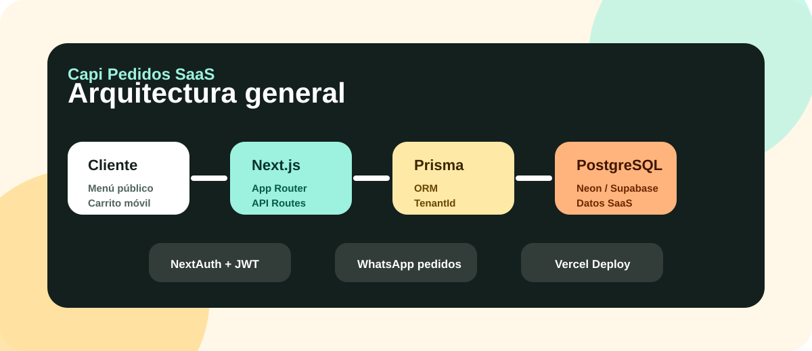
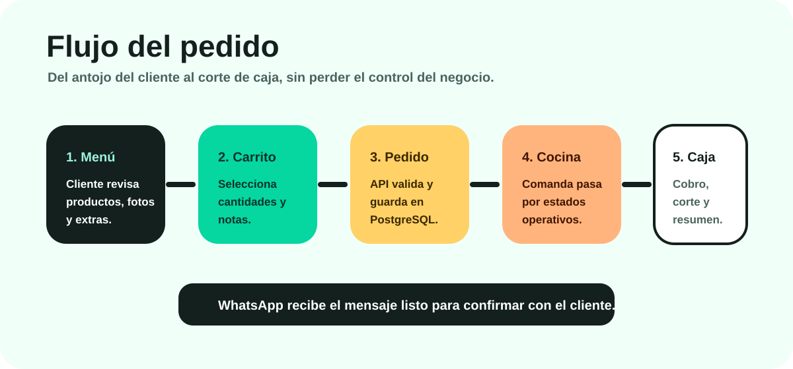

# Documentación técnica - Capi Pedidos SaaS

Fecha de actualización: abril 2026  
Estado: base colaborativa pública, preparada para despliegues propios.  
Versión documental: v0.093.

---

## 1. Objetivo

Capi Pedidos SaaS es una plataforma multi-tenant para restaurantes y negocios de comida. Permite publicar menús digitales, recibir pedidos por WhatsApp y administrar operación diaria desde un panel web.

La aplicación está pensada para México y Latinoamérica:

- Textos en español México.
- Precios en pesos mexicanos.
- Demos con ejemplos de comida mexicana.
- Flujo operativo compatible con restaurantes pequeños y medianos.
- Módulos opcionales para negocios que ya tienen punto de venta.

---

## 2. Explicación simple para personas no técnicas

Piensa en Capi como tres piezas conectadas:

| Pieza | Explicación simple |
|---|---|
| 📱 Menú público | Lo que ve el cliente para elegir productos. |
| 🧑‍💼 Panel admin | Lo que usa el restaurante para administrar menú, pedidos, cocina y caja. |
| 🗄️ Base de datos | Donde se guarda todo: negocios, usuarios, productos, pedidos y cortes. |

Cada restaurante tiene su propio espacio de datos. Eso se llama `multi-tenant`.

---

## 3. Arquitectura

| Capa | Tecnología | Responsabilidad |
|---|---|---|
| Web app | Next.js 16 App Router | Landing, menú público, admin y API routes |
| UI | React 19 + Tailwind CSS 4 | Interfaz responsive |
| Autenticación | NextAuth Credentials + JWT | Login y sesión admin |
| ORM | Prisma | Modelo de datos y consultas |
| Base de datos | PostgreSQL | Persistencia multi-tenant |
| Hosting sugerido | Vercel | Build, deploy, dominio, SSL y Cron |
| Datos demo | @faker-js/faker | Ventas, pedidos y cortes realistas |

---

## 4. Flujo de pedido

1. El cliente entra a `/<slug>`.
2. Revisa categorías, productos, ingredientes, imágenes y modificadores según plan.
3. Agrega productos al carrito.
4. Captura datos de contacto y tipo de servicio.
5. El frontend envía `POST /api/orders`.
6. El backend recalcula precios, valida productos y guarda `Order` + `OrderItem`.
7. El pedido aparece en `/admin/orders` y, si aplica, en `/admin/kitchen`.
8. El sistema devuelve URL de WhatsApp con mensaje listo.
9. Caja puede marcar pago y cerrar corte.

---

## 5. Multi-tenant

Cada negocio vive como un `Tenant`.

| Concepto | Uso |
|---|---|
| `Tenant` | Restaurante o negocio cliente. |
| `tenantId` | Llave que separa datos por negocio. |
| `slug` | Nombre usado en URL pública, por ejemplo `/fonda_lupita`. |
| `version` | Plan contratado: Lite, Pro o Enterprise. |

Regla crítica:

> Toda consulta operativa debe respetar `tenantId`. Si se omite, existe riesgo de mezclar datos entre negocios.

---

## 6. Roles

| Rol | Uso |
|---|---|
| `SUPER_ADMIN` | Administra tenants, planes, vigencias y demos. |
| `ADMIN` | Opera un negocio específico. |
| `STAFF` | Reservado para futuras funciones de personal. |

---

## 7. Modelo de datos principal

| Modelo | Uso |
|---|---|
| `Tenant` | Negocio/cliente SaaS |
| `User` | Usuarios administrativos |
| `Category` | Categorías del menú |
| `Product` | Productos vendibles |
| `Ingredient` | Ingredientes visibles en menú público |
| `ModifierGroup` | Grupos de modificadores |
| `Modifier` | Opciones de modificador con precio |
| `Order` | Pedido |
| `OrderItem` | Producto dentro del pedido |
| `CashCut` | Corte de caja |
| `Settings` | Configuración del negocio y tema público |

---

## 8. Enums relevantes

| Enum | Valores principales |
|---|---|
| `Version` | `LITE`, `PRO`, `ENTERPRISE` |
| `PublicTemplate` | `CLASICO`, `MERCADO`, `ELEGANTE`, `TAQUERIA`, `MARISQUERIA`, `CAFETERIA`, `PIZZERIA`, `SUSHI`, `HAMBURGUESAS`, `ANTOJITOS`, `BAR_BOTANERO`, `DARK_KITCHEN`, `POLLERIA` |
| `OrderStatus` | `PENDING`, `CONFIRMED`, `PREPARING`, `READY`, `COMPLETED`, `CANCELLED` |
| `ServiceType` | `MOSTRADOR`, `MESA`, `RECOGER`, `DOMICILIO` |
| `PaymentStatus` | `PENDIENTE`, `PAGADO`, `CANCELADO` |
| `PaymentMethod` | `EFECTIVO`, `TARJETA`, `TRANSFERENCIA`, `OTRO` |

---

## 9. Rutas principales

| Ruta | Tipo | Acceso |
|---|---|---|
| `/` | Landing comercial | Público |
| `/[slug]` | Menú público por negocio | Público |
| `/t/[slug]` | Alias interno de menú público | Público |
| `/admin/login` | Login administrativo | Público |
| `/admin` | Dashboard | Autenticado |
| `/admin/categories` | Categorías | Autenticado |
| `/admin/products` | Productos, ingredientes y modificadores | Autenticado |
| `/admin/orders` | Pedidos y analytics | Autenticado |
| `/admin/kitchen` | Monitor de cocina | Autenticado |
| `/admin/cash` | Caja diaria | Autenticado |
| `/admin/settings` | Ajustes del negocio | Autenticado |
| `/admin/tenants` | Gestión SaaS de negocios | Solo `SUPER_ADMIN` |
| `/api/orders` | Crear pedido | Público |
| `/api/cron/reset-demos` | Reiniciar demos vencidas | Protegido por `CRON_SECRET` |

---

## 10. Diferencias por plan

| Función | Lite | Pro | Enterprise |
|---|---:|---:|---:|
| Categorías/productos | ✅ | ✅ | ✅ |
| Pedidos por WhatsApp | ✅ | ✅ | ✅ |
| Control de agotados | ✅ | ✅ | ✅ |
| Imágenes | ❌ | ✅ | ✅ |
| Ingredientes visibles | ❌ | ✅ | ✅ |
| Modificadores avanzados | ❌ | ✅ | ✅ |
| Búsqueda/filtros | ❌ | ✅ | ✅ |
| Analytics | ❌ | ✅ | ✅ |
| Monitor de cocina | ❌ | ✅ | ✅ |
| Caja diaria | ❌ | ✅ | ✅ |
| Dashboard enriquecido | Básico | ✅ | ✅ |
| Gestión SaaS multi-cliente | Super admin | Super admin | Super admin |

---

## 11. Variables de entorno

| Variable | Uso | Sensible |
|---|---|---|
| `DATABASE_URL` | Conexión PostgreSQL pooling | Sí |
| `DIRECT_URL` | Conexión directa Prisma | Sí |
| `NEXTAUTH_URL` | URL base de auth | No |
| `NEXT_PUBLIC_APP_URL` | Origen público para headers | No |
| `NEXTAUTH_SECRET` | Firma de sesión | Sí |
| `ROOT_DOMAIN` | Dominio raíz para multi-tenant | No |
| `DEFAULT_TENANT_SLUG` | Tenant fallback | No |
| `SEED_ADMIN_EMAIL` | Usuario super admin local | Depende |
| `SEED_ADMIN_PASSWORD` | Password super admin local | Sí |
| `SEED_DEMO_EMAIL_DOMAIN` | Dominio de correos demo local | No |
| `SEED_DEMO_PASSWORD` | Password demo local | Sí |
| `CRON_SECRET` | Protección del cron | Sí |
| `NEXT_PUBLIC_DEMO_EMAIL_DOMAIN` | Dominio mostrado en login demo | No |

---

## 12. Seeds demo

`prisma/seed.ts` crea negocios ficticios:

| Slug | Giro | Plan |
|---|---|---|
| `fonda_lupita` | Cocina económica | Lite |
| `taqueria_don_jose` | Taquería | Pro |
| `grupo_nopal` | Operación premium | Enterprise |
| `mariscos_el_faro` | Marisquería | Pro |
| `cafe_amanecer` | Cafetería | Pro |
| `pizza_barrio` | Pizzería | Pro |

También genera pedidos, ventas, cancelaciones y cortes de caja para mostrar dashboards con datos.

---

## 13. Seguridad actual

- Passwords hasheados con bcrypt.
- Sesiones JWT firmadas por `NEXTAUTH_SECRET`.
- Validaciones con Zod en API.
- Headers de seguridad en `next.config.ts`.
- Aislamiento de rutas admin por sesión.
- Super admin restringido para gestión de tenants.

---

## 14. Riesgos y siguientes mejoras

| Riesgo/mejora | Prioridad |
|---|---|
| Rate limiting en login y pedidos | Alta |
| Auditoría de cambios admin | Alta |
| Pruebas automatizadas end-to-end | Media |
| Permisos por rol más finos | Media |
| Inventario/recetas/costos | Media |
| Integración de pagos de suscripción | Media |
| QR por mesa | Media |
| Facturación | Baja/según mercado |

---

## 15. Notas para IA y colaboradores

- Mantener UI en español México.
- No introducir textos en inglés visibles al usuario final.
- No exponer datos reales en código o docs.
- Antes de tocar consultas, revisar que usen `tenantId`.
- Antes de tocar planes, asegurar que Lite/Pro/Enterprise no prometan funciones inexistentes.
- Si se agregan nuevas variables, actualizar `.env.example`, README y esta documentación.

Lee también:

- [Guía de agentes IA](./AGENTES_IA.md)
- [Guía de vibecoding](./GUIA_VIBECODING.md)
