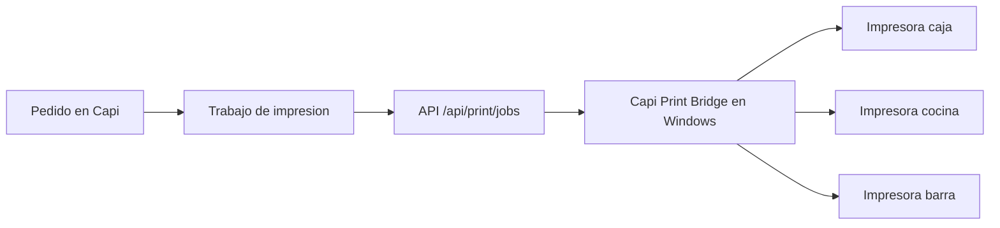

# Impresion local con Capi Print Bridge

Capi genera trabajos de impresion en la nube, pero las impresoras termicas normalmente estan conectadas a una computadora local del restaurante. Para unir esos dos mundos existe **Capi Print Bridge**.

## Que es Capi Print Bridge

Es una app local para Windows, basada en Electron, que:

1. Se instala en la computadora del restaurante.
2. Lee una configuracion local.
3. Consulta trabajos pendientes en Capi.
4. Descarga el ticket HTML.
5. Imprime silenciosamente en la impresora configurada.
6. Marca el trabajo como impreso o fallido.

## Flujo completo



## Tipos de ticket

| Tipo | Uso |
|---|---|
| Ticket de venta | Se entrega al cliente despues de cobrar. |
| Ticket de produccion | Cocina o barra lo usa para preparar. |
| Precuenta | Se imprime antes de cobrar y bloquea la cuenta hasta autorizar cambios. |
| Corte de caja | Resumen de cobros, entradas, salidas y diferencias. |

## Areas de impresion

| Area | Ejemplo |
|---|---|
| CAJA | Ticket final de venta. |
| COCINA | Tacos, tortas, platillos calientes. |
| BARRA | Bebidas, cafe, cocteles. |
| GENERAL | Negocios pequenos con una sola impresora. |

## Configuracion en el panel

En el restaurante:

```text
Admin > Impresion
```

Ahi se puede:

- Crear estaciones de impresion.
- Elegir area: caja, cocina, barra o general.
- Escribir el nombre exacto de la impresora instalada en Windows.
- Asignar categorias a una estacion.
- Elegir ancho de ticket: 58 mm u 80 mm.
- Configurar mensajes del ticket, WiFi, propina y redes sociales.

## Instalacion para Windows

1. Instala Node.js 20 o superior.
2. Entra a la carpeta:

```powershell
cd tools/capi-print-bridge
npm install
```

3. Copia la configuracion:

```powershell
Copy-Item config.example.json config.json
```

4. Edita `config.json`:

```json
{
  "baseUrl": "https://capi.nohmendez.xyz",
  "tenantSlug": "taqueria_don_jose",
  "token": "TOKEN_PRIVADO_DE_IMPRESION",
  "pollEveryMs": 5000,
  "defaultPrinterName": "POS-80",
  "areas": {
    "CAJA": "POS-80",
    "COCINA": "Cocina",
    "BARRA": "Barra"
  }
}
```

5. Prueba en modo desarrollo:

```powershell
npm run dev
```

6. Genera instalador:

```powershell
npm run dist
```

El instalador se genera en la carpeta `dist`.

## Recomendaciones de impresora

- Para caja: 80 mm si se imprimen totales, cambio, propina y mensajes.
- Para cocina: 58 mm puede funcionar si el negocio es pequeno.
- Usar nombres de impresora sin acentos ni simbolos raros.
- Probar primero con una impresora general antes de separar cocina/barra/caja.

## Errores comunes

| Problema | Posible solucion |
|---|---|
| No imprime nada | Revisar que la impresora aparezca en Windows. |
| Imprime en otra impresora | Revisar `deviceName` en Admin > Impresion. |
| Sale duplicado | Revisar que solo haya un puente local activo por estacion. |
| Error 401 | Token de impresion incorrecto. |
| Error 404 | `tenantSlug` incorrecto. |
| Letras raras | Usar UTF-8 y evitar nombres con simbolos en impresoras viejas. |
| Ticket cortado | Cambiar ancho entre 58 mm y 80 mm en configuracion. |

## Seguridad

- El token de impresion no debe estar en GitHub.
- Cada restaurante debe tener su propio token.
- Si una computadora se pierde o cambia de dueno, rota el token.
- No uses el token de reportes para impresion.
